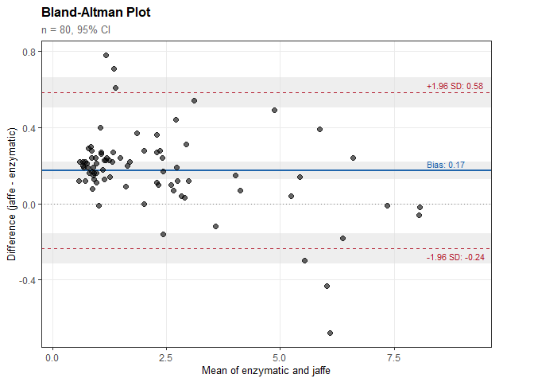
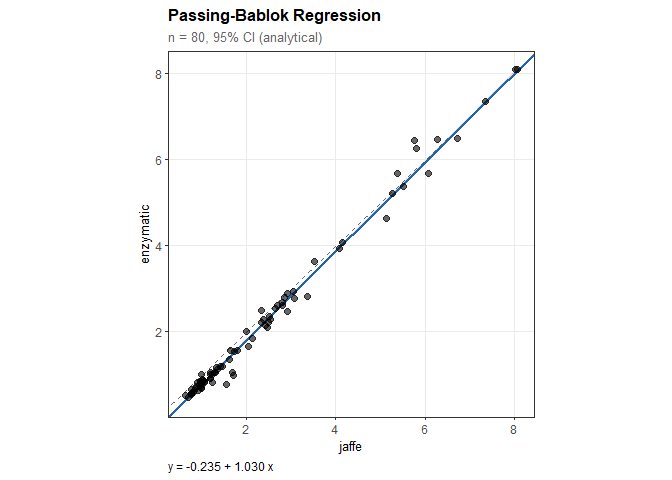
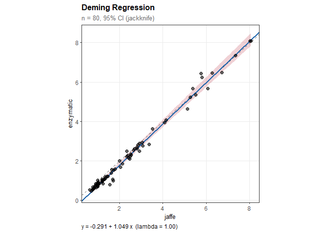

<!-- README.md is generated from README.Rmd. Please edit that file -->

# valytics 

<!-- badges: start -->

[](https://github.com/marcellogr/valytics/actions/workflows/R-CMD-check.yaml)
<!-- badges: end -->

Statistical methods for analytical method comparison and validation
studies. The package implements Bland-Altman analysis, Passing-Bablok
regression, and Deming regression — approaches commonly used in clinical
laboratory method validation.

## Installation

You can install the development version of valytics from
[GitHub](https://github.com/) with:

``` r
# install.packages("pak")
pak::pak("marcellogr/valytics")
```

## Overview

`valytics` provides three complementary approaches for method
comparison:

| Method             | Use Case                       | Key Output                                            |
|--------------------|--------------------------------|-------------------------------------------------------|
| **Bland-Altman**   | Assess agreement               | Bias, limits of agreement                             |
| **Passing-Bablok** | Non-parametric regression      | Slope, intercept (robust to outliers)                 |
| **Deming**         | Errors-in-variables regression | Slope, intercept (accounts for error in both methods) |

## Quick Start

``` r
library(valytics)

# Load example data
data(creatinine_serum)

# All three methods in one workflow
ba <- ba_analysis(enzymatic ~ jaffe, data = creatinine_serum)
pb <- pb_regression(enzymatic ~ jaffe, data = creatinine_serum)
dm <- deming_regression(enzymatic ~ jaffe, data = creatinine_serum)
```

## Example: Bland-Altman Analysis

``` r
ba
#> 
#> Bland-Altman Analysis
#> ---------------------------------------- 
#> n = 80 paired observations
#> 
#> Difference type: Absolute (y - x)
#> Confidence level: 95%
#> 
#> Results:
#>   Bias (mean difference): 0.174
#>     95% CI: [0.127, 0.220]
#>   SD of differences: 0.209
#> 
#> Limits of Agreement:
#>   Lower LoA: -0.236
#>     95% CI: [-0.316, -0.156]
#>   Upper LoA: 0.584
#>     95% CI: [0.504, 0.663]
```

``` r
plot(ba)
```



## Example: Passing-Bablok Regression

``` r
pb
#> 
#> Passing-Bablok Regression
#> ---------------------------------------- 
#> n = 80 paired observations
#> 
#> CI method: Analytical (Passing-Bablok 1983)
#> Confidence level: 95%
#> 
#> Regression equation:
#>   enzymatic = -0.235 + 1.030 * jaffe
#> 
#> Results:
#>   Intercept: -0.235
#>     95% CI: [-0.245, -0.233]
#>     (excludes 0: significant constant bias)
#> 
#>   Slope: 1.030
#>     95% CI: [1.025, 1.034]
#>     (excludes 1: significant proportional bias)
```

``` r
plot(pb)
```



## Example: Deming Regression

``` r
dm
#> 
#> Deming Regression
#> ---------------------------------------- 
#> n = 80 paired observations
#> 
#> Error ratio (lambda): 1.000
#> CI method: Jackknife
#> Confidence level: 95%
#> 
#> Regression equation:
#>   enzymatic = -0.291 + 1.049 * jaffe
#> 
#> Results:
#>   Intercept: -0.291 (SE = 0.032)
#>     95% CI: [-0.355, -0.227]
#>     (excludes 0: significant constant bias)
#> 
#>   Slope: 1.049 (SE = 0.016)
#>     95% CI: [1.018, 1.080]
#>     (excludes 1: significant proportional bias)
```

``` r
plot(dm)
```



## Choosing a Method

| Scenario                                           | Recommended Method    |
|----------------------------------------------------|-----------------------|
| Assess overall agreement, define acceptable limits | Bland-Altman          |
| Robust regression, potential outliers              | Passing-Bablok        |
| Known error structure, parametric inference        | Deming                |
| Quick comparison of systematic differences         | Any regression method |

**Use Bland-Altman** when you want to quantify the range of disagreement
between methods and define clinically acceptable limits.

**Use Passing-Bablok** when you want a non-parametric regression that is
robust to outliers and makes minimal assumptions.

**Use Deming** when you have knowledge about the error ratio between
methods (e.g., from validation data) or when the parametric assumptions
are reasonable.

## Features

- **Multiple interfaces**: Vector input or formula syntax
  (`method1 ~ method2`)
- **Flexible CI methods**: Analytical, jackknife, or bootstrap BCa
- **Assumption checking**: CUSUM linearity test, Shapiro-Wilk normality
  test
- **Publication-ready plots**: Built on ggplot2, fully customizable
- **Tidy workflows**: Consistent API across all methods

## Example Datasets

| Dataset            | Description                       | n   |
|--------------------|-----------------------------------|-----|
| `glucose_methods`  | POC meter vs. laboratory analyzer | 60  |
| `creatinine_serum` | Enzymatic vs. Jaffe methods       | 80  |
| `troponin_cardiac` | Two hs-cTnI platforms             | 50  |

## References

**Bland-Altman:** Bland JM, Altman DG (1986). Statistical methods for
assessing agreement between two methods of clinical measurement.
*Lancet*, 1(8476):307-310.

**Passing-Bablok:** Passing H, Bablok W (1983). A new biometrical
procedure for testing the equality of measurements from two different
analytical methods. *J Clin Chem Clin Biochem*, 21(11):709-720.

**Deming:** Linnet K (1993). Evaluation of regression procedures for
methods comparison studies. *Clin Chem*, 39(3):424-432.

## License

GPL-3
